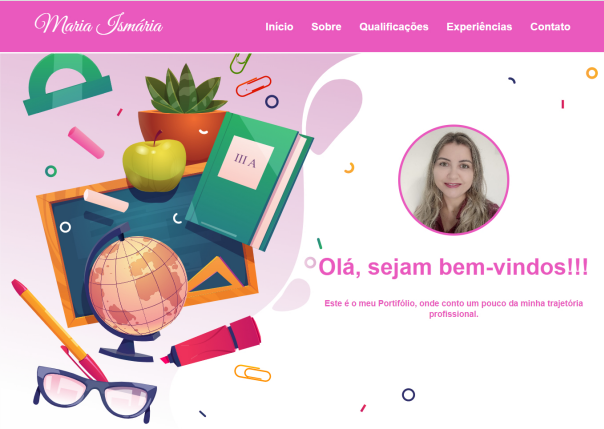
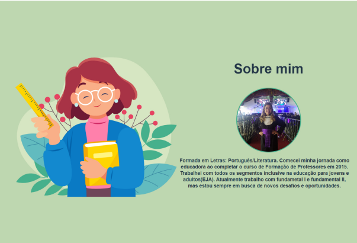
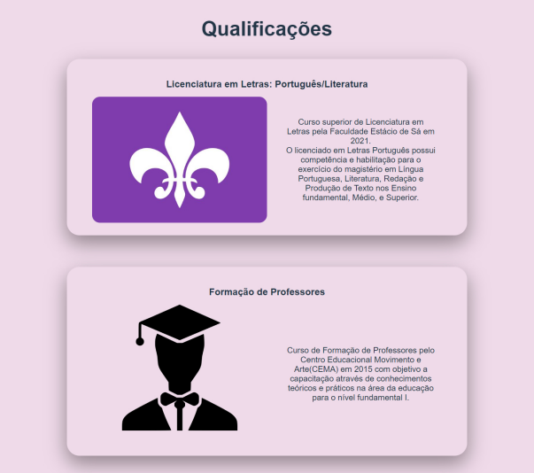
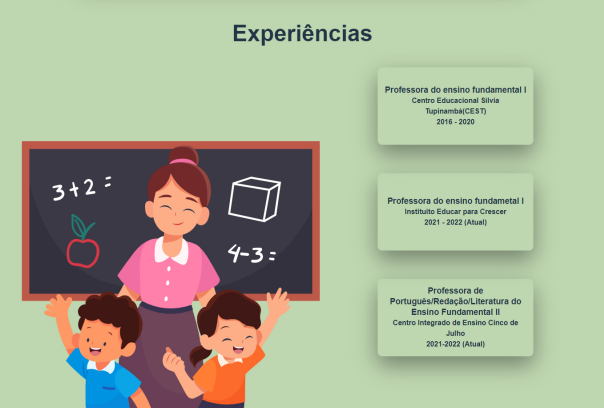
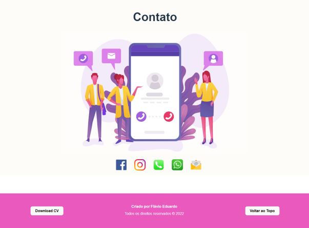

# Portifólio Maria Ismária
   Portifólio desenvolvido para recolocação no mercado de trabalho.
### Link: https://flavioeds82.github.io/Maria_Ismaria_Portifolio/
 
## Technology 

### Aqui estão as tecnologias utilizadas neste projecto: 

* React 
* Vite
* Styled-components
* Typescript

          

## Serviços e hospedagem

* Github
* GithubPages

## Instalação:

* npm install

* cd mary
  
* npm run dev
  
# Imagens do Projeto:

### 1 - Seção Início:

### 2 - Secão Sobre:

### 3 - Secão Qualificações:

### 4 - Secão Experiências:

### 2 - Secão Contato:

#

## Versioning

  2022.1

  ## Authors

  * **Flávio Eduardo** 

 ### Obrigado pela visita, me siga em minhas redes sociais!!!